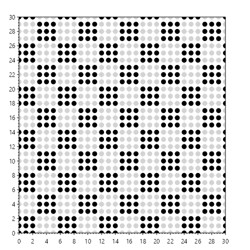
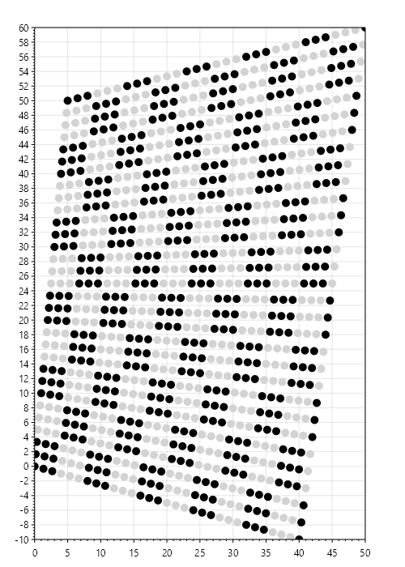
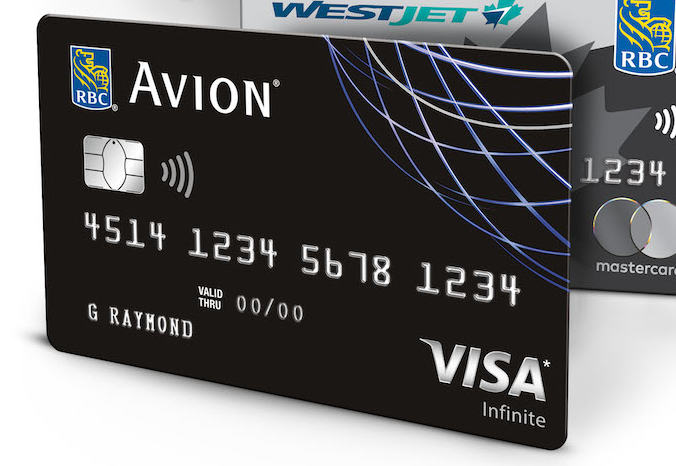
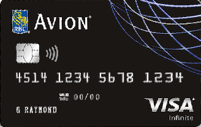
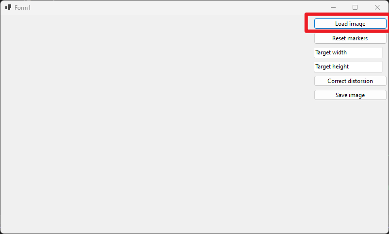
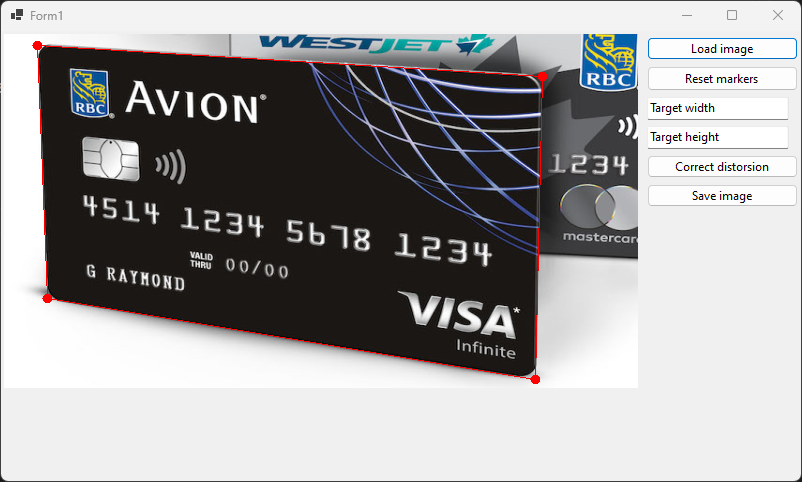
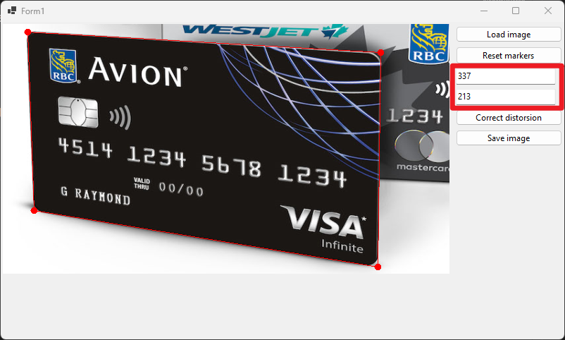
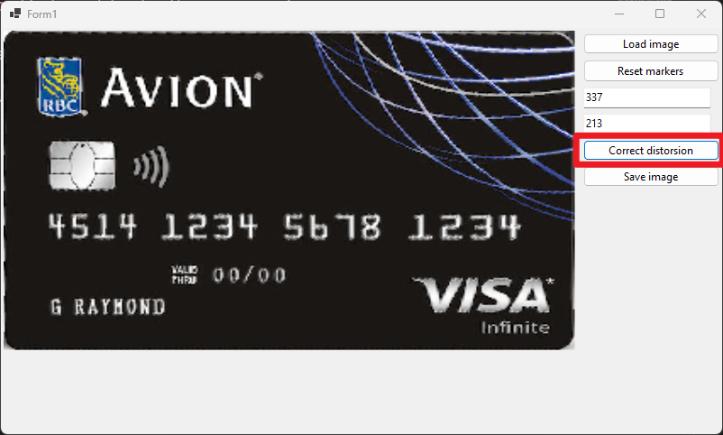

# Correct Trapezoidal Distorsion

This is the UI wrapper for the trapezoidal correction algorithm in the project [Trapezoidal Distorsion](https://github.com/joejeye/trapezoidalcorrection).

---

## Introduction

Trapezoidal distorsion  (also known as [keystone effect](https://en.wikipedia.org/wiki/Keystone_effect)) is the effect that photos of rectangles look like trapezes . The following two figures show an example:

This program corrects the trapezoidal distorsion given the boundary of the trapeze and the original size (width and height in pixels) of the rectangle.

## Sample Output

Photo before correction:

Photo after correction (cropped to the region of interest):

## How To Use

1. Load image

Click the `Load image` button to load image into the program window.

2. Place points

Place 4 points in the image by click in it. The first point is the bottom-left vertex, the second point is the bottom-right vertex, the third point is the top-right vertex, the fourth point is the top-left vertex.

3. Adjust bounding box

Drag to move the four points that was placed in the previous step to have the bounding box fit the region of interest

4. Type in width and height

Type in the width and height in pixels of the desired image.

5. Correct distorsion

Click the button `Correct distorsion`, the image after correction will be displayed.

6. Save the image

Click the `Save image` button to save the corrected image.